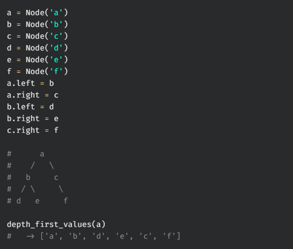
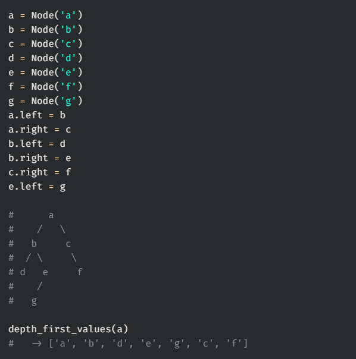
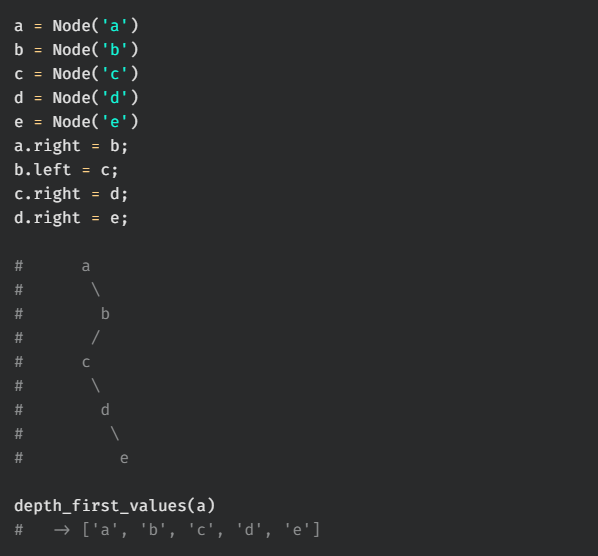

# depth first values

Write a function, `depth_first_values`, that takes in the root of a binary tree. The function should return a list containing all values of the tree in depth-first order.

## Test Cases

`test_00:`  

`test_01:`  

`test_02:`  

`test_03:`  

`test_04:`  
