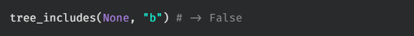

# tree includes

Write a function, `tree_includes`, that takes in the root of a binary tree and a target value. The function should return a boolean indicating whether or not the value is contained in the tree.

## Test Cases

`test_00:`  

`test_01:`  

`test_02:`  

`test_03:`  

`test_04:`  

`test_05:`  
