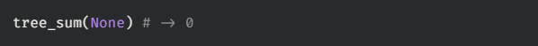

# tree sum

Write a function, `tree_sum`, that takes in the root of a binary tree that contains number values. The function should return the total sum of all values in the tree.

## Test Cases

`test_00:`  

`test_01:`  

`test_02:`  
