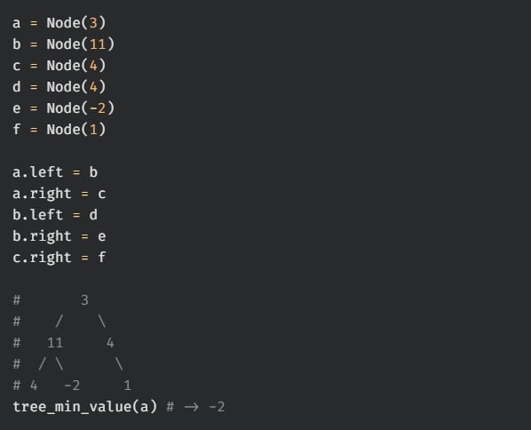
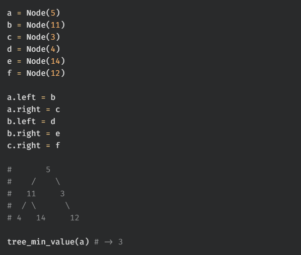
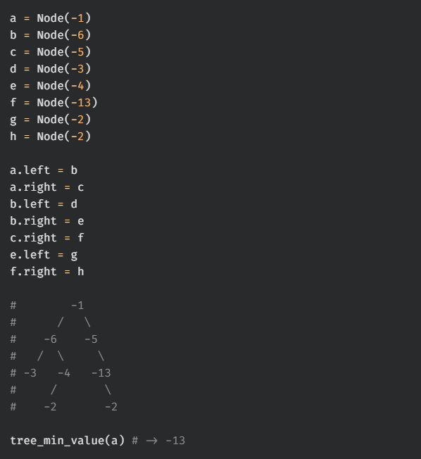
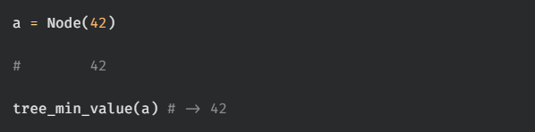

# tree min value

Write a function, `tree_min_value`, that takes in the root of a binary tree that contains number values. The function should return the minimum value within the tree.

You may assume that the input tree is non-empty.

## Test Cases

`test_00:`  

`test_01:`  

`test_02:`  

`test_03:`  
