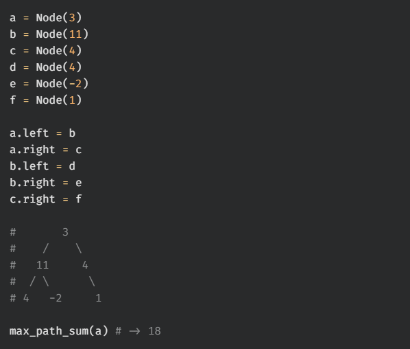
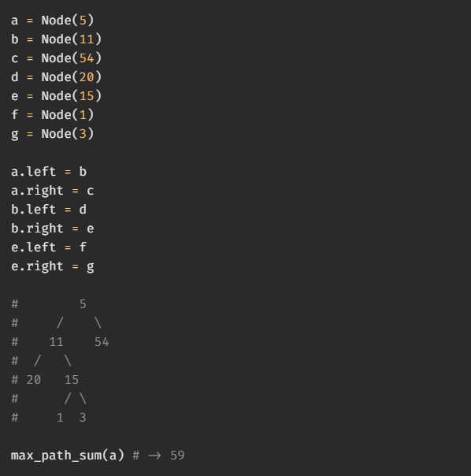
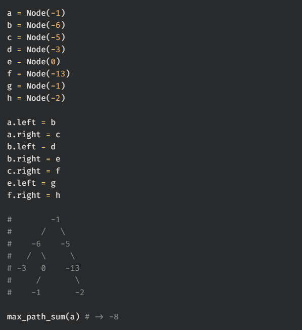
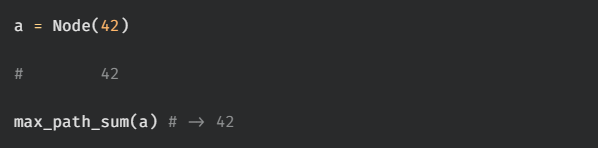

# max root to leaf path sum

Write a function, `max_path_sum`, that takes in the root of a binary tree that contains number values. The function should return the maximum sum of any root to leaf path within the tree.

You may assume that the input tree is non-empty.

## Test Cases

`test_00:`  

`test_01:`  

`test_02:`  

`test_03:`  
